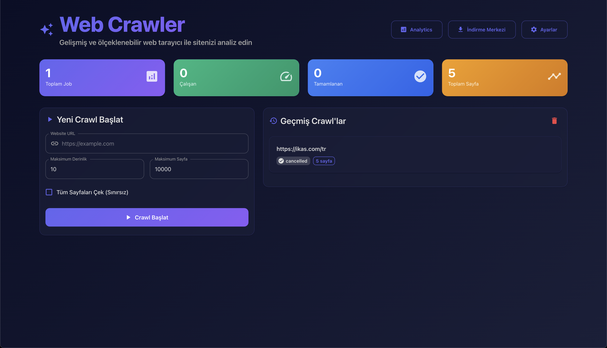
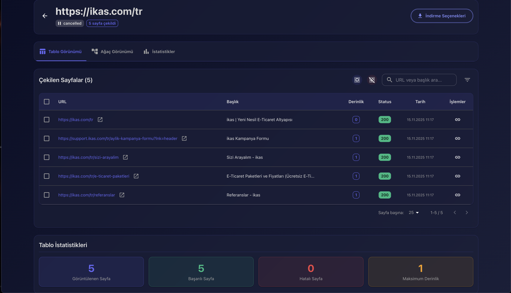
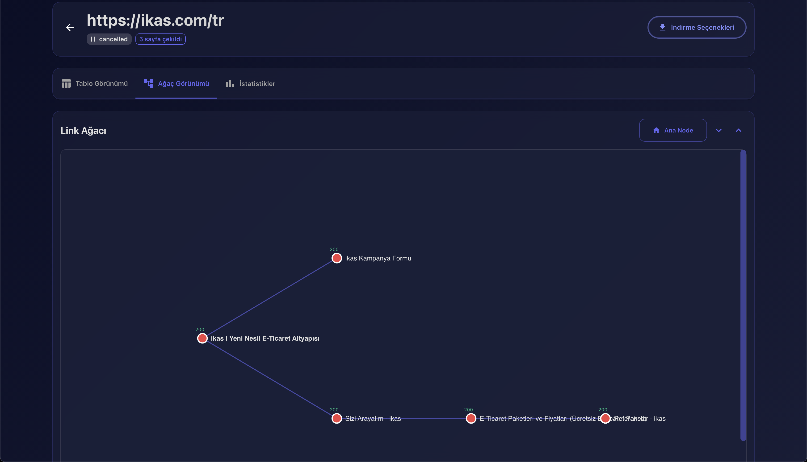
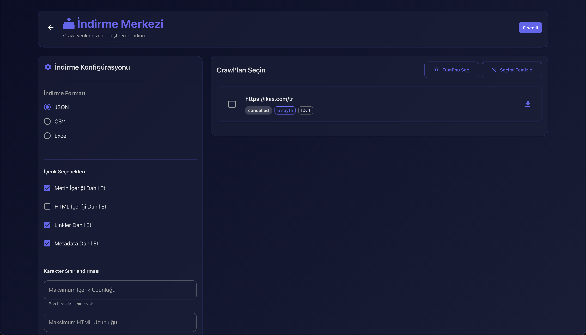

Web Crawler

FastAPI tabanlı backend ile React + Vite arayüzüne sahip modern ve ölçeklenebilir bir web tarayıcı. Web sitelerini tarayın, iç link ağacını görselleştirin ve verileri farklı formatlarda dışa aktarın.

Öne çıkanlar
- Derinlik ve sayfa sınırıyla tarama
- robots.txt uyumu ve nazik hız sınırlama
- Metin ve metadata çıkarımı
- Link ağacı görselleştirme
- Esnek seçeneklerle JSON/CSV/Excel dışa aktarma

Depo yapısı
- `backend`: FastAPI servisi, tarayıcı motoru, SQLite/Postgres desteği
- `frontend`: React (Vite) arayüzü, analiz ve görseller
- `docker-compose.yml`: Yerelde Postgres/Redis + uygulama

Hızlı başlangıç

Yerel (geliştirme için önerilir)
- Gerekli araçlar: Python 3.13+, Node 18+, Redis (opsiyonel), SQLite veya Postgres
- Backend
  1. `cd backend && python -m venv venv && source venv/bin/activate`
  2. `pip install -r requirements.txt`
  3. `backend/ENV.EXAMPLE` dosyasını `backend/.env` olarak kopyalayıp düzenleyin
  4. `uvicorn app.main:app --host 0.0.0.0 --port 8000 --reload`
- Frontend
  1. `cd frontend`
  2. `npm install`
  3. `frontend/ENV.EXAMPLE` dosyasını `.env` olarak kopyalayıp `VITE_API_URL` değerini ayarlayın (varsayılan `http://localhost:8000/api/v1`)
  4. `npm run dev` (Vite boş bir port seçecektir; genelde 5173 veya 300x)

Docker (hepsi bir arada)
- `docker compose up -d --build`
- Backend: `http://localhost:8000` (dokümantasyon `/docs`)
- Frontend: `http://localhost:3000`

Ortam değişkenleri
- Backend: `backend/ENV.EXAMPLE` içine bakın
  - `DATABASE_URL`, `REDIS_URL`, `API_V1_PREFIX`, `CORS_ORIGINS`
  - `MAX_DEPTH`, `MAX_PAGES`, `REQUEST_DELAY`, `CONCURRENT_REQUESTS`, `USER_AGENT`
- Frontend: `frontend/ENV.EXAMPLE`
  - `VITE_API_URL` backend API adresi (varsayılan `http://localhost:8000/api/v1`)

Komutlar
- Backend
  - Şema oluştur (SQLite): `python -c "from app.database.connection import engine, Base; Base.metadata.create_all(bind=engine)"`
  - Geliştirme sunucusu: `uvicorn app.main:app --host 0.0.0.0 --port 8000 --reload`
- Frontend
  - Geliştirme: `npm run dev`
  - Derleme: `npm run build`
  - Önizleme: `npm run preview`

Ekran görüntüleri
Şu dosyaları `docs/screenshots/` içine yerleştirin:
- `dashboard.png`
- `table-view.png`
- `tree-view.png`
- `download-center.png`

Paylaştığınız görüntüler için önerilen isimler:
- Ana gösterge paneli → `dashboard.png`
- Tablo görünümü (sayfa listesi) → `table-view.png`
- Ağaç görünümü (link grafiği) → `tree-view.png`
- İndirme merkezi → `download-center.png`

Sorun giderme
- 8000 portu dolu: Mevcut süreci kapatın (`lsof -ti :8000 | xargs kill -9`) ve uvicorn’u yeniden başlatın.
- Vite farklı port seçiyor: Terminal çıktısını veya `frontend/frontend.log` dosyasını kontrol edin. İsterseniz `npm run dev -- --port 3000` ile sabitleyin.
- SQLite yolu: `backend/app/config.py` göreli SQLite yolunu backend köküne mutlak olarak sabitler.

Katkı
Önemli değişiklikler için önce bir konu açın. PR’lar memnuniyetle karşılanır.

